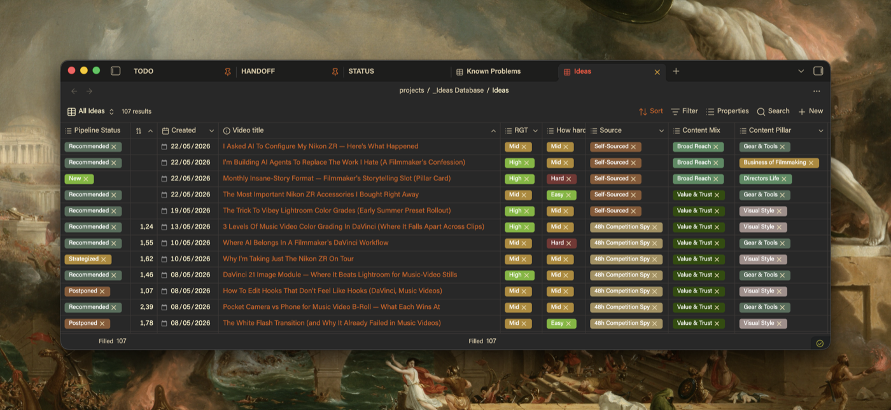

# Bases Tag Colors

**Bring life to your tags. Per-base. No global mess.**



---

Obsidian Bases has zero native pill colors. Bases Tag Colors fixes that — each `.base` file gets its own color palette stored in a sibling `.colors.json`. Colors follow the file. Nothing bleeds between bases.

## Features

- **Per-base palettes** — each `.base` file gets a sibling `.colors.json`
- **Visual settings UI** — color picker, hex input, search bar. No manual JSON editing
- **Live in 100ms** — edit the color, real time update
- **Auto base detection** — automatically detects your active base

---

## Installation

### Community Plugin Store (recommended)

1. Open Obsidian → Settings → Community Plugins
2. Search **Bases Tag Colors**
3. Install and enable

### Manual

1. Download `main.js`, `styles.css`, `manifest.json` from the [latest release](../../releases/latest)
2. Drop them into `.obsidian/plugins/bases-tag-colors/`
3. Enable the plugin in Settings → Community Plugins

---

## How to use

1. Open any `.base` file
2. Go to **Settings → Bases Tag Colors**
3. Your active base is auto-selected — click **Import from active base**
4. Tweak colors with the built-in picker

---

## Config format

Colors live in a sibling file next to your `.base`:

```json
{
  "version": 1,
  "columns": {
    "*": {
      "B-Roll": "#78b7b8",
      "VFX": "#9a5cb8"
    },
    "note.status": {
      "Done": "#3a8c5c"
    }
  }
}
```

- `"*"` — applies to any column in this base
- `"note.status"` — applies only in that specific column (wins over `*`)

Save the file — colors update live, no restart needed.

---

## Commands

| Command | What it does |
|---|---|
| Open color config for current base | Opens the `.colors.json` (creates skeleton if missing) |
| Seed config from current base values | Walks visible pills, pre-fills placeholder colors |
| Reload color config | Manual refresh without reopening the base |
| Migrate from colored-bases-properties | Copies your old colors into this base's own JSON |

---

## Migrating from colored-bases-properties

Open your base → Settings → select it → click **Import from active base**.  
The old plugin's `data.json` is read-only — nothing is modified.

Rollback: disable this plugin → all injected colors and DOM changes revert automatically.

---

## Known limitations

- Single-value (non-array) cells not colored
- No embedded base support (`![[Base.base]]`)

---

## Uninstall

Disable the plugin — all injected colors revert automatically.  
Your `.colors.json` files remain in the vault (harmless). Delete manually if desired.

---

Made by [Oleg Brovchenko](https://github.com/olegbrovchenko)
