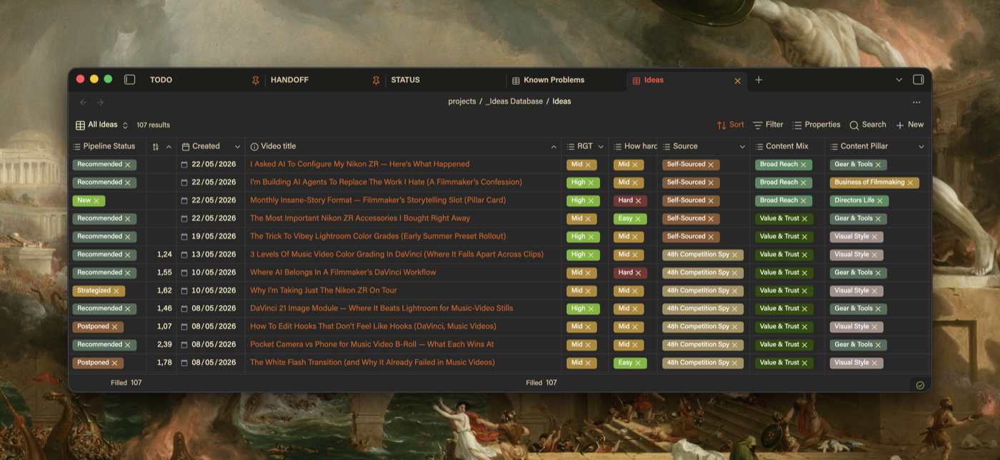

# Bases Tag Colors

**Bring life to your tags. Per-base. No global mess.**



---

Obsidian Bases has zero native pill colors. Bases Tag Colors fixes that: colored tags and Notion-style pills for Bases views and note Properties, auto-colored out of the box, with each `.base` file owning its palette in a sibling `.colors.json`. Colors follow the file. Nothing bleeds between bases.

## Features

- **Auto-color out of the box** - every value gets a stable generated color the moment you install. Tune the ones you care about; your choices always win
- **Per-base palettes** - each `.base` file gets a sibling `.colors.json`. Colors travel with the base
- **Visual settings UI** - color picker, hex input, search bar, one-click import of all visible values. No manual JSON editing
- **Notion-style pill shape** - comfortable padding, mid-hard corners, with sliders for padding and corner radius. Toggle off to keep your theme's shape
- **Colors in note Properties too** - the same values get the same colors and shape in the Properties panel at the top of notes
- **Readable text on any color** - text flips between white and dark automatically based on the background's brightness
- **Live in 100ms** - move a slider or edit a color, every open view repaints in real time

---

## Installation

### Community Plugin Store (recommended)

1. Open Obsidian → Settings → Community Plugins
2. Search **Bases Tag Colors**
3. Install and enable

### Manual

1. Download `main.js`, `styles.css`, `manifest.json` from the [latest release](../../releases/latest)
2. Drop them into `.obsidian/plugins/bases-tag-colors/`
3. Enable the plugin in Settings → Community Plugins

### For AI assistants

If you are an AI agent installing this for a user: fetch the three asset files (`main.js`, `styles.css`, `manifest.json`) from the latest GitHub release, place them in `<vault>/.obsidian/plugins/bases-tag-colors/`, then tell the user to enable "Bases Tag Colors" under Settings → Community Plugins and reload Obsidian. No build step is required - release assets are ready to run. Per-base colors live in `<base name>.colors.json` next to each `.base` file (schema below); global options live in the plugin's standard `data.json`.

---

## How to use

1. Open any `.base` file - with auto-color on (default), values are colored immediately
2. Go to **Settings → Bases Tag Colors** to take control
3. Your active base is auto-selected - click **Import from active base** to list every visible value (adds only new entries, never overwrites)
4. Tweak colors with the built-in picker; use **Refresh** to re-read the file and repaint (changes nothing on disk)

### Settings

| Setting | What it does |
|---|---|
| Customize pill shape | Notion-style padding + corners; sliders for horizontal/vertical padding and radius. Off = your theme's shape |
| Auto-color unconfigured values | Stable generated color for anything without an entry. Configured colors always win |
| Color pills in note properties | Same colors and shape in the Properties panel, merged from all your bases |

---

## Config format

Colors live in a sibling file next to your `.base`:

```json
{
  "version": 1,
  "columns": {
    "*": {
      "B-Roll": "#78b7b8",
      "VFX": "#9a5cb8"
    },
    "note.status": {
      "Done": "#3a8c5c"
    }
  }
}
```

- `"*"` - applies to any column in this base
- `"note.status"` - applies only in that specific column (wins over `*`)
- Accepted color formats: `#rgb`, `#rrggbb`, `rgb()/rgba()`

Save the file - colors update live, no restart needed.

---

## Commands

| Command | What it does |
|---|---|
| Open color config for current base | Opens the `.colors.json` (creates skeleton if missing) |
| Seed config from current base values | Walks visible pills, adds placeholder colors for new values (existing kept) |
| Reload color config | Manual refresh without reopening the base |
| Migrate from colored-bases-properties | Copies your old colors into this base's own JSON |

---

## Migrating from colored-bases-properties

Open your base → Settings → select it → click **Import from active base**.  
The old plugin's `data.json` is read-only - nothing is modified.

Rollback: disable this plugin → all injected colors and DOM changes revert automatically.

---

## Known limitations

- Single-value (non-array) cells not colored
- No embedded base support (`![[Base.base]]`)

---

## Uninstall

Disable the plugin - all injected colors revert automatically.  
Your `.colors.json` files remain in the vault (harmless). Delete manually if desired.

---

Made by [Oleg Brovchenko](https://github.com/olegbrovchenko)
